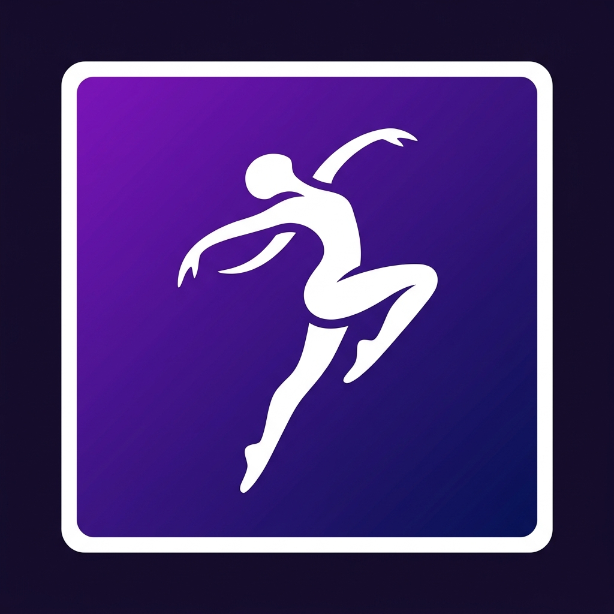

# Dance Count Metronome (ダンスカウント・メトロノーム)

ダンスの練習に最適な、英語カウント（1〜8）を再生するブラウザベースのメトロノームアプリです。
BPMの変更、男性/女性ボイスの切り替え、裏拍（And）のカウント設定が可能です。



## 特徴

- **高精度なタイミング**: Web Audio API を使用し、ブラウザ上でもサンプル精度の正確なリズムを実現。
- **8カウント・インジケーター**: 現在のカウント位置を8個のドットで視覚的に表示。
- **ボイス選択**: 男性（Male）と女性（Female）の音声をワンタッチで切り替え。
- **BPM制御**: 60〜200 BPM の範囲で調整可能（スライダーと数値入力）。
- **With "And" モード**: 1& 2& 3&... と裏拍のカウントを追加可能。
- **モダンなUI**: ダークモードを基調としたグラスモーフィズムデザイン。

## 技術スタック

- **Framework**: Next.js 15 (App Router)
- **Language**: TypeScript
- **Audio Logic**: Web Audio API
- **Styling**: CSS Modules
- **Development**: Docker / Docker Compose
- **Sound Generation**: espeak-ng / ffmpeg (自動生成スクリプト)

## 開発環境のセットアップ

このプロジェクトは Docker を使用して開発環境を構築します。ホストマシンに Node.js や音声ライブラリをインストールする必要はありません。

### 1. リポジトリのクローン
```bash
git clone <repository-url>
cd dance-count-metronom
```

### 2. 環境の起動
Docker Compose を使用してコンテナを立ち上げます。
```bash
docker-compose up -d
```
起動後、ブラウザで [http://localhost:3000](http://localhost:3000) にアクセスしてください。

### 3. 音声ファイルの生成（初回のみ）
コンテナ内のツールを使用して音声ファイルを自動生成します。
```bash
docker-compose run --rm app bash scripts/generate-sounds.sh
```
※ `public/sounds/` 配下に `male/` および `female/` のカウント音声（MP3）が生成されます。

## プロジェクト構成

```text
├── src/
│   ├── app/            # ページ構成・グローバルスタイル
│   ├── components/     # UIコンポーネント（BPM制御、ボイス選択等）
│   ├── hooks/          # メトロノーム再生ロジック（useMetronome）
│   └── lib/            # 音声エンジン（AudioEngine）
├── public/
│   └── sounds/         # 生成された音声ファイル
├── scripts/
│   └── generate-sounds.sh # 音声生成スクリプト
├── Dockerfile
└── docker-compose.yml
```

## ライセンス

MIT License
